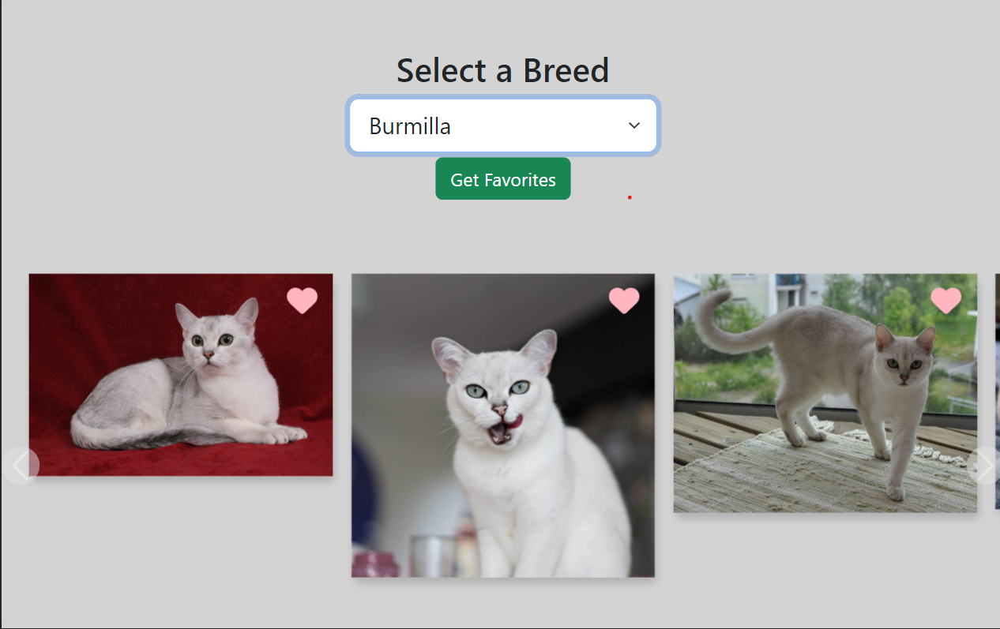
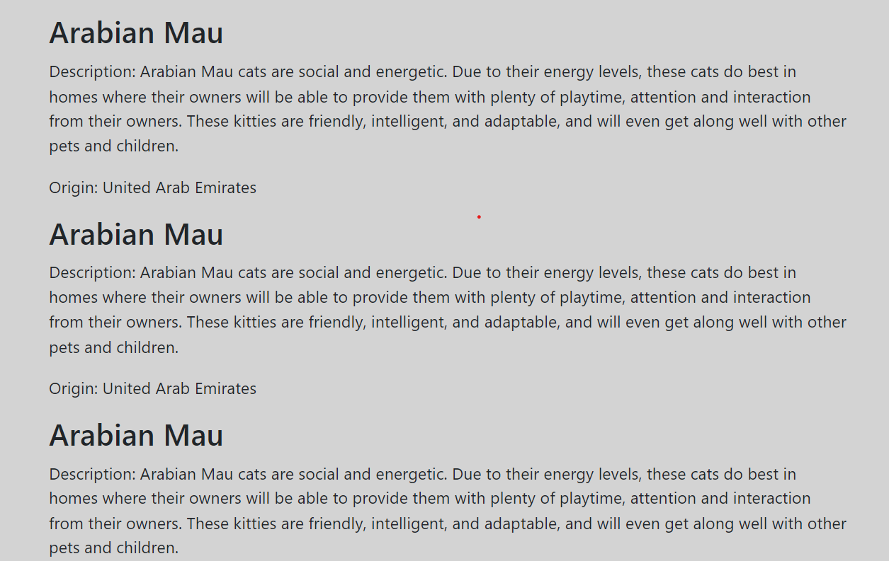

# ALAB 308A.4.1 Fetch

Create an interactive, dynamic webpage that serves content from an external API using Axios and Fetch.

### Learning Objectives
By completion of this lab, learners will be able to:

- Request data from an external API using Fetch and Axios.
- Create an interactive, dynamic webpage that serves content from an external API.
- Use async/await and promises to create synchronous logic in asynchronous actions.
- POST data to and DELETE data from an external API.

### The Cat API
For the purposes of this lab, we'll be working with The [Cat API](https://thecatapi.com), which is a free public API. Head to the API's website and create a free account.

The first step to working with any API is exploring its documentation. Every API you work with will be different, so never make any assumptions.

Once you have generally familiarized yourself with the API, continue to the tasks below.

### Tasks
Now that you know what you already have, here's what you need to do. These steps are best accomplished in order, but feel free to approach the problem differently if you see a creative and efficient solution:

1. Create an async function `"initialLoad"` that does the following:

- Retrieve a list of breeds from the cat API using `fetch()`.
- Create new <options> for each of these breeds, and append them to `breedSelect`.

    - Each option should have a value attribute equal to the id of the breed.
    - Each option should display text equal to the name of the breed.
- This function should execute immediately.

2. Create an event handler for `breedSelect` that does the following:

- Retrieve information on the selected breed from the cat API using `fetch()`.

  - Make sure your request is receiving multiple array items!
  - Check the API documentation if you're only getting a single object.
- For each object in the response array, create a new element for the carousel.

  - Append each of these new elements to the carousel.
- Use the other data you have been given to create an informational section within the `infoDump` element.

  - Be creative with how you create DOM elements and HTML.
  - Feel free to edit `index.html` and `styles.css` to suit your needs, but be careful!
  - Remember that functionality comes first, but user experience and design are important.
- Each new selection should clear, re-populate, and restart the carousel.
- Add a call to this function to the end of your `initialLoad` function above to create the initial carousel.

### Screenshots
The Cat Web Application

### Getting Started
Clone the repository.